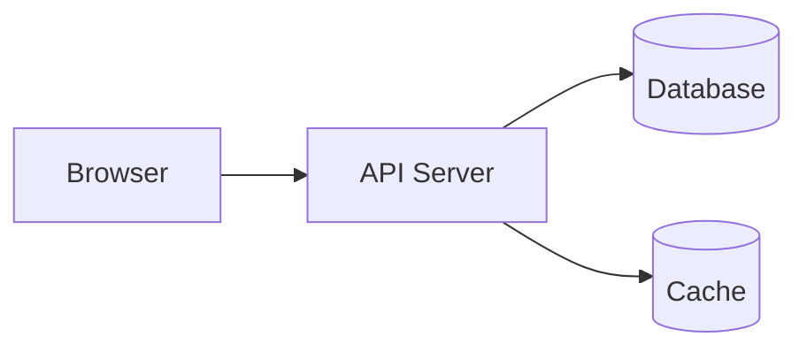
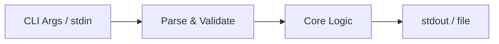
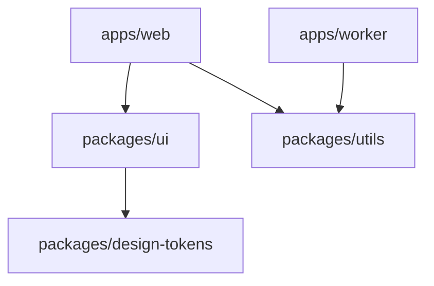
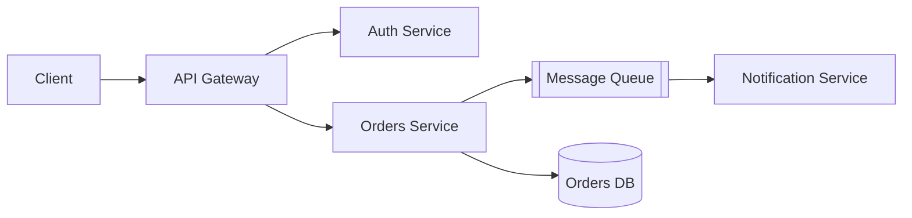
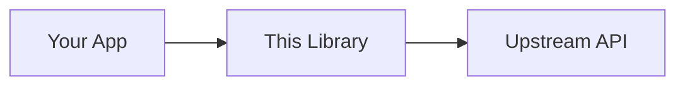

# Mermaid Diagram Templates

Use one of these under "What is this?" in `readme-template.md`, in place of `{{ARCHITECTURE_DIAGRAM}}`, only when the repo has enough distinct components to make a diagram informative — skip it for single-file utilities. Adapt the template rather than starting from scratch.

**Web app (client/server/db):**

**CLI tool:**

**Monorepo package graph:**

**Microservices:**

**Library/SDK consumer flow:**

