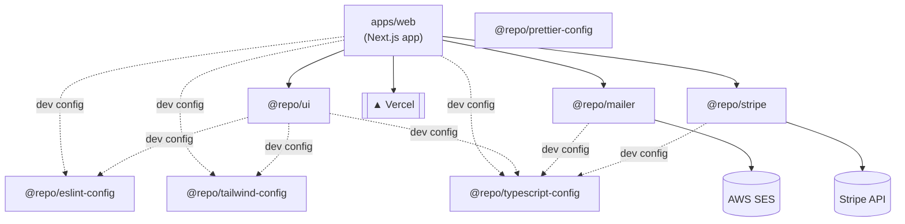

# JSConfMx Core 🇲🇽⚡

**Last updated:** 2026-07-20 18:37

## Project Summary

Core monorepo for JSConf México — the website and shared infrastructure powering the conference's online presence. It centralizes the marketing/ticketing web app and reusable packages (UI kit, transactional mail, payments) so the community team can ship features consistently across the event's digital properties.

## Tech Stack

- ⚡ Next.js 16 (App Router)
- 🔷 TypeScript
- 🎨 Tailwind CSS 4
- 💳 Stripe (payments)
- ✉️ AWS SES + Nodemailer (transactional email)
- 📦 Turborepo (pnpm workspaces)
- ▲ Vercel (deployment target)

## Monorepo Structure

```text
.
├── apps/
│   └── web/                  # Next.js marketing/ticketing site
│       ├── app/
│       └── public/
└── packages/
    ├── ui/                   # Shared React component library (@repo/ui)
    ├── mailer/               # Email sending via AWS SES (@repo/mailer)
    ├── stripe/               # Stripe client wrapper (@repo/stripe)
    ├── eslint-config/        # Shared ESLint configs (@repo/eslint-config)
    ├── prettier-config/      # Shared Prettier config (@repo/prettier-config)
    ├── tailwindcss-config/   # Shared Tailwind config (@repo/tailwind-config)
    └── typescript-config/    # Shared tsconfig bases (@repo/typescript-config)
```

## Architecture Diagram



## Apps & Packages

### apps/web

Next.js 16 site — the JSConf México web presence. Renders the homepage (`app/page.tsx`), sends email via a server action (`app/email-sender.ts` → `@repo/mailer`), and consumes shared UI components and styles from `@repo/ui`.

**Scripts:** `dev` (port 3000), `build`, `start`, `lint`, `check-types`

### packages/ui (`@repo/ui`)

Shared React 19 component library and Tailwind styles, consumed by `apps/web` (e.g. `Card`). Ships compiled output from `dist/`.

**Scripts:** `build:styles`, `build:components`, `dev:styles`, `dev:components`, `lint`, `check-types`

### packages/mailer (`@repo/mailer`)

Transactional email sending, wrapping AWS SES (`@aws-sdk/client-sesv2`) and Nodemailer. Exposes `sendEmail`, used by `apps/web`'s email server action.

**Scripts:** `check-types`

### packages/stripe (`@repo/stripe`)

Thin wrapper around the `stripe` SDK for payment/ticketing integration.

**Scripts:** `check-types`

### packages/eslint-config (`@repo/eslint-config`)

Shared ESLint flat-config presets: `base`, `next-js`, `react-internal`.

### packages/prettier-config (`@repo/prettier-config`)

Shared Prettier config with import-sorting and Tailwind class-sorting plugins.

### packages/tailwindcss-config (`@repo/tailwind-config`)

Shared Tailwind CSS 4 config and PostCSS setup, exported as CSS/JS entry points.

### packages/typescript-config (`@repo/typescript-config`)

Shared base `tsconfig.json` files for consistent TypeScript settings across the monorepo.

## How to Run the Project

```bash
pnpm install       # install workspace dependencies

pnpm dev           # run all apps/packages in dev mode (turbo run dev)
pnpm build         # build all apps/packages (turbo run build)
pnpm lint          # lint all workspaces
pnpm check-types   # type-check all workspaces
pnpm format        # format .ts/.tsx/.md files with Prettier
```

Requires Node ≥20 and pnpm 9 (managed via `packageManager` in root `package.json`).

---

📝 Documentation auto-generated with Claude Haiku — do not edit by hand, run /document-monorepo to update.
