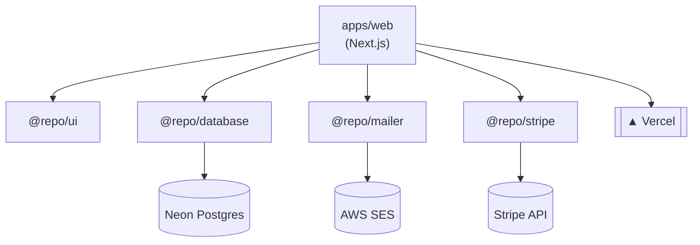

<div align="center">

# JSConfMx Core

Monorepo powering the JSConf México website — marketing/ticketing web app plus the shared packages behind it.

[](../../stargazers)
[](../../graphs/contributors)


</div>

## What is this?

This repo holds the JSConf México web presence and the infrastructure it depends on: a Next.js app for marketing and ticket checkout, and a set of internal `@repo/*` packages (UI kit, database, transactional email, payments) shared across it. It's a [Turborepo](https://turborepo.com) managed with pnpm workspaces.



## Quick Start

Requires Node ≥20 and pnpm 9 (pinned via `packageManager` in `package.json`).

```bash
pnpm install
pnpm dev
```

This runs every app/package in dev mode via Turborepo; `apps/web` comes up at [http://localhost:3000](http://localhost:3000).

Other root scripts:

| Command | Description |
|---|---|
| `pnpm build` | Build all apps/packages (`turbo run build`) |
| `pnpm lint` | Lint all workspaces |
| `pnpm check-types` | Type-check all workspaces |
| `pnpm format` | Format `.ts`/`.tsx`/`.md` with Prettier |
| `pnpm db:generate` | Generate the Prisma client (`turbo run db:generate`) |
| `pnpm db:migrate:dev` | Run Prisma migrations against the dev database |

### Environment Variables

`apps/web` needs a `.env` (see `apps/web/.env.example`) for checkout, email, and the database to work:

| Variable | Used for |
|---|---|
| `DATABASE_URL` | Neon Postgres connection string (Prisma, `@repo/database`) |
| `STRIPE_SECRET_KEY`, `STRIPE_PRICE_ID` | Stripe checkout (`@repo/stripe`) |
| `STRIPE_WEBHOOK_SIGNING_SECRET` | Verifies Stripe webhook signatures in `app/api/webhook/route.ts` — not in `.env.example` yet, add it when wiring up webhooks locally |
| `INFRA_REGION`, `INFRA_ACCESS_KEY_ID`, `INFRA_SECRET_ACCESS_KEY` | AWS SES admin email notifications (`@repo/mailer`) |

`packages/database` also reads its own `DATABASE_URL` from a local `.env` for Prisma CLI commands (`pnpm db:generate`, `pnpm db:migrate:dev`).

## Packages

| Path | Package | Description |
|---|---|---|
| `apps/web` | `web` | Next.js 16 site — homepage, Stripe checkout (`actions/checkoutStripe.ts`, `app/api/webhook`), and a transactional email server action, built on `@repo/ui` and `@repo/database`. |
| `packages/ui` | `@repo/ui` | Shared React 19 component library and Tailwind styles, published as compiled output from `dist/`. |
| `packages/database` | `@repo/database` | Prisma data layer on Neon Postgres via `@prisma/adapter-pg`; exports a singleton client and generated types. |
| `packages/mailer` | `@repo/mailer` | Transactional email via AWS SES (`@aws-sdk/client-sesv2`) and Nodemailer. |
| `packages/stripe` | `@repo/stripe` | Thin wrapper around the `stripe` SDK for payments/ticketing. |
| `packages/eslint-config` | `@repo/eslint-config` | Shared ESLint flat-config presets: `base`, `next-js`, `react-internal`. |
| `packages/prettier-config` | `@repo/prettier-config` | Shared Prettier config with import-sorting and Tailwind class-sorting plugins. |
| `packages/tailwindcss-config` | `@repo/tailwind-config` | Shared Tailwind CSS 4 config and PostCSS setup. |
| `packages/typescript-config` | `@repo/typescript-config` | Shared base `tsconfig.json` files. |

## Project Structure

```text
.
├── apps/
│   └── web/                  # Next.js marketing/ticketing site
└── packages/
    ├── database/              # Prisma + Neon data layer (@repo/database)
    ├── eslint-config/          # Shared ESLint configs
    ├── mailer/                 # Email sending via AWS SES (@repo/mailer)
    ├── prettier-config/        # Shared Prettier config
    ├── stripe/                 # Stripe client wrapper (@repo/stripe)
    ├── tailwindcss-config/     # Shared Tailwind config
    ├── typescript-config/      # Shared tsconfig bases
    └── ui/                     # Shared React component library (@repo/ui)
```

## Deployment

`apps/web` deploys to [Vercel](https://vercel.com) (`vercel.json` at the repo root pins the build/install commands to the pnpm scripts above).

## Contributing

No `CONTRIBUTING.md` yet — open a PR against `main`. Run `pnpm lint` and `pnpm check-types` before pushing; both run across every workspace via Turborepo.
